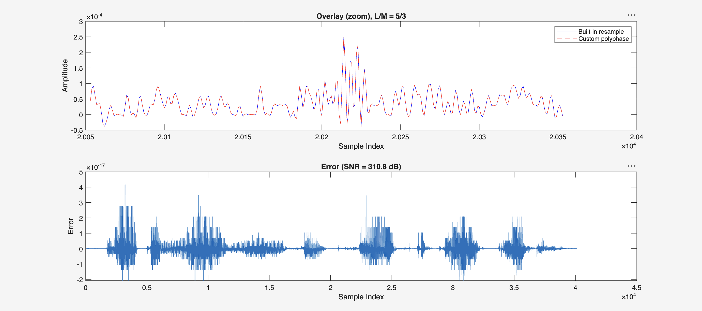
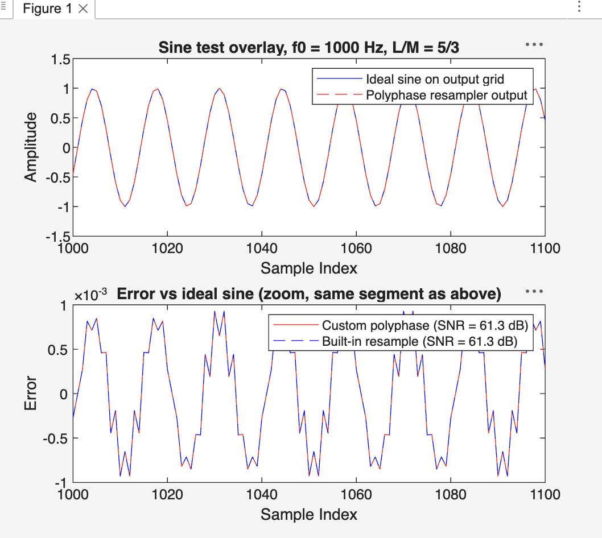

# Polyphase FIR Audio Resampler (MATLAB, From Scratch)

**A from scratch MATLAB implementation of sample rate conversion by any rational factor L/M, matching MATLAB's built-in `resample()` to machine precision: 310 dB SNR.** The built-in function is used only to validate the result, never in the implementation.



Top: the custom output (red) sits exactly on the built-in output (blue). Bottom: the difference between them is on the order of 1e-17, which is the floating point limit.

## Architecture

The naive way to resample by L/M runs a lowpass filter at the highest rate and throws most of the work away. The polyphase structure splits the filter into L short branches that all run at the low rate, so every multiplication uses a real input sample and every computed output sample is kept:

```
                 +-------------------+
          +----> | branch 0  (Q taps)| ----+
          |      +-------------------+     |
          |      +-------------------+     |     output
  x[n] ---+----> | branch 1  (Q taps)| ----+--> commutator ---> y[m]
          |      +-------------------+     |   (selects branch
          |              ...               |    mM mod L)
          |      +-------------------+     |
          +----> | branch L-1 (Q taps)| ---+
                 +-------------------+
```

Branch i holds the filter taps h(i), h(i+L), h(i+2L), ... and for each output sample the commutator picks exactly one branch, so the full filter quality is achieved at a fraction of the naive cost.

**Operation count.** The naive approach runs the full filter (N taps) on every sample of the upsampled signal: about N multiplications per high rate sample, times L times the input length. The polyphase structure computes only the samples that survive the downsampling, each from a single branch of N/L taps. The saving is therefore a factor of **L times M**: 15x for the 5/3 demo, and 23,520x for a practical 44.1 kHz to 48 kHz conversion (L/M = 160/147).

## What it demonstrates

1. **Single filter design.** One lowpass FIR (Kaiser window, beta = 5, cutoff `min(1/L, 1/M)`) acts as both anti-imaging and anti-aliasing filter, with gain L to compensate the upsampling.

2. **Polyphase decomposition.** The filter is split into L branches, so all arithmetic runs at the low rate.

3. **Vectorized execution.** Output samples that share a branch have input windows that slide by exactly M samples, so each branch is one matrix vector product. The entire resampler is a loop of only L iterations.

4. **Exact delay compensation.** The FIR group delay is an integer at the upsampled rate, so it is folded into the polyphase index arithmetic and the output is aligned by construction, for any L and M.

## Usage

```matlab
y = polyphase_resample(x, L, M);   % resample x by the rational factor L/M
```

Two scripts exercise the function:

- `demo.m` resamples an included speech recording, plays the result, and produces the validation figure above (overlay and error against `resample()`).
- `test_sine.m` is an independent correctness test: a pure sine must come out of the resampler as the same sine on the new time grid, with the same amplitude and phase. Unlike the comparison with `resample()`, this does not assume anything about MATLAB's internals.



Both implementations land on exactly 61.3 dB against the ideal sine, and their error curves coincide. This number is the passband ripple of the chosen Kaiser window (beta = 5), so the residual error is the documented cost of the filter design, shared identically by both implementations, and not an artifact of either one.

## Files

- `polyphase_resample.m` is the resampler itself
- `demo.m` runs it on speech and validates against `resample()`
- `test_sine.m` validates independently against an ideal synthetic sine
- `benchmark.m` compares runtime against `resample()` across several ratios
- `speech_8khz.wav` is the sample recording used by the demo
- `validation_results.png` and `sine_test_results.png` are the output figures

## References

- MATLAB documentation: [`resample`](https://www.mathworks.com/help/signal/ref/resample.html)

## License

MIT
